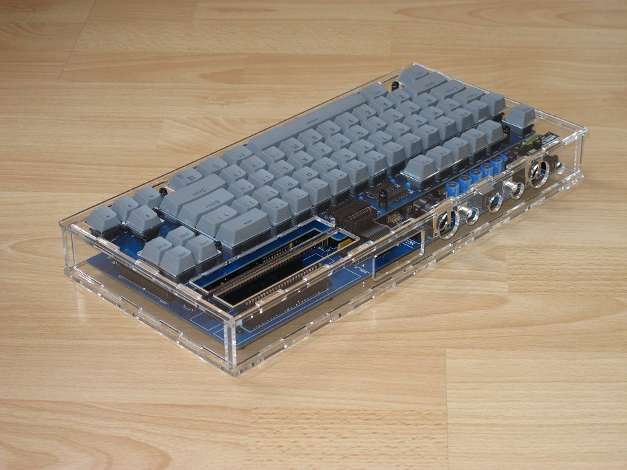

# Omega Enclosure
Acrylic Enclosure for the Omega Home Computer

## Introduction
This is a laser cut acrylic enclosure for the Omega Home Computer.
The design assumes that it will be laser cut from a 3 mm acrylic (or similar plastic) sheet.

## Hardware Documentation

### Build Instructions

The enclosure is assembled in the following order:

1. Eleven M3 x 12 screws are placed through holes in the bottom panel
2. 3 mm washers are placed on these screws on the top side of the bottom panel
3. The main board PCB is placed on top of washers
4. Seven M3 x 15 mm standoffs are screwed on the top of the screws, excluding the holes next to the MSX cartridge slots
5. Four M3 hex nuts are used to secure the board next to the slots, optionally placing the slots guide 3D printed part
6. (Optional) Switch is connected to the header on the mainboard
7. The keyboard PCB is placed on top of standoffs. It is secured using one M3 hex nut under the space bar, and using six M3 x 10 mm standoffs elsewhere
8. Four side panels are placed through the cut outs in the bottom plate. (Optional) Switch is mounted on the back panel
9. The top panel is assembed on the standoffs using six M3 x 8 mm screws

### Bill of Materials - Version 1.0

Component type     | Reference | Description                       | Quantity | Possible sources and notes
------------------ | --------- | --------------------------------- | -------- | --------------------------
Standoff           |           | M3 x 10 mm, female, OD: 5 mm hex  | 6        | Mouser [534-24393](https://www.mouser.com/ProductDetail/534-24393)
Standoff           |           | M3 x 15 mm, male/female, OD: 5 mm hex  | 7   | Mouser [534-24315](https://www.mouser.com/ProductDetail/534-24315)
Screw              |           | M3 x 12 mm, Flat Socket Cap       | 11       | Fastenal [M42510012A40000](https://www.fastenal.com/products/details/M42510012A40000)
Screw              |           | M3 x 8 mm, Flat Socket Cap        | 6        | Fastenal [M42510008A40000](https://www.fastenal.com/products/details/M42510008A40000)
Nut                |           | M3 hex                            | 5        | Fastenal [MN2510000A20000](https://www.fastenal.com/products/details/MN2510000A20000)
Acrylic panel      |           | [Bottom plate](Enclosure/Omega-Eco1_User.dxf) | 1 | Laser cut from 3 mm acrylic
Acrylic panel      |           | [Top plate, side plates, washers](Enclosure/Omega-Eco2_User.dxf) | 1 | Laser cut from 3 mm acrylic
3D Printed Part    |           | [Slots guide](Enclosure/Omega-Slots_Guide.stl) | 1 | (Optional) 3D Print
Switch             |           | Toggle Switch                     | 1        | (Optional) Mouser [612-100-A1121](https://www.mouser.com/ProductDetail/612-100-A1121). This switch is mounted on the back panel, and it can be used to switch between two halves of the ROM, e.g. for switching between MSX2 BIOS and C-BIOS. Alternatively, a push button for a reset can be installed in that location.

## Release Notes

## Changes
* Version 1.0
  * Initial version

## Known Issues
